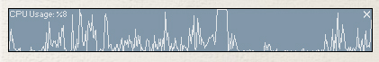



## CPU graph

### Description

A visual CPU graph
 
### More Info
 

             |
---                |---
**Submitted On**   |2004-02-18 21:28:26
**By**             |[Mark Anthony Entingh](https://github.com/Planet-Source-Code/PSCIndex/blob/master/ByAuthor/mark-anthony-entingh.md)
**Level**          |Intermediate
**User Rating**    |5.0 (10 globes from 2 users)
**Compatibility**  |VB 3\.0, VB 4\.0 \(32\-bit\), VB 5\.0, VB 6\.0
**Category**       |[Windows API Call/ Explanation](https://github.com/Planet-Source-Code/PSCIndex/blob/master/ByCategory/windows-api-call-explanation__1-39.md)
**World**          |[Visual Basic](https://github.com/Planet-Source-Code/PSCIndex/blob/master/ByWorld/visual-basic.md)
**Archive File**   |[CPU\_graph1710642182004\.zip](https://github.com/Planet-Source-Code/mark-anthony-entingh-cpu-graph__1-51861/archive/master.zip)

